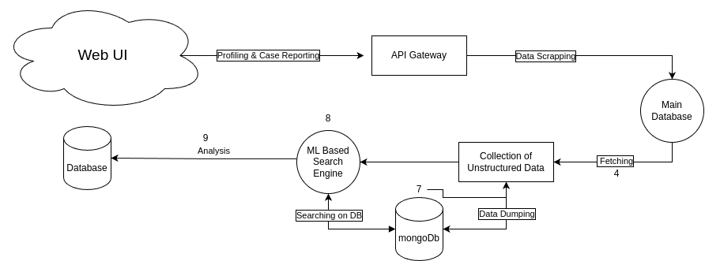
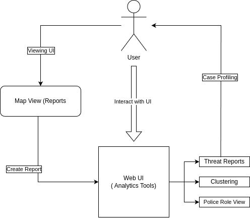
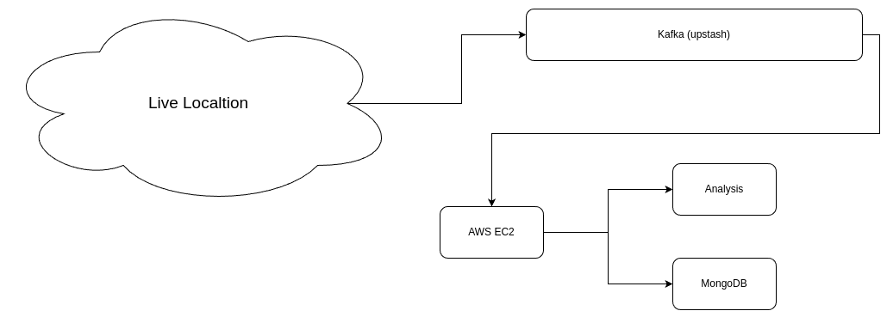

# Odoo Combat 2024

**How to Run**

- First run all the Docker Contianers: `sudo sh start.sh`

- ~~Run Node Query App (Install all dependencies first)
`pnpm i`~~ (Update: Fixed the Issue)

- Go to http://localhost:5147, the UI will be loaded (Read the Operator Guider before Proceeding)
- All ui can be view from  ` [POST] http://localhost:5147 `
 Read the API References before Proceeding.

 
## **How to Operate**
- Check the Video: [Video](https://drive.google.com/file/d/1

## Features
|Features| In Service |
|-|--|
|  Real Time Location Update  | ✅ |
| User and Police Role user Reporting |✅ |
| Good Looking UI | ✅ |
| RBAC integrated on UI | ❌ | 
| Real/Near Real-Time Streaming |  *✅ |
| Multi-Parameters | ✅ |
| Anonymous Reporting | ✅ |
| Map Display | ✅ |
| Search Functionality | ✅ |
| Clustering | ✅ |
| Heatmaps | ✅ |

**Things to know :**

 1. Ignoring RBAC as i'm short on Time. Refer the doc: [RBAC Repo](https://github.com/imabhisht/edtech-management)

 2. Everything is Dockerize, so you can run it on Distributed System for Fault Tolerence System.

## System Design

 ** System Design**

 ** Workflow Diagram for Crime Reporting**

 ** Live Location tracking for realtime PCR & Crime Reporting**

### System Architecture:

-   **Decoupling:**
    
    -   log processing components are decoupled through Kafka.
    -   Kafka acts as a message broker, facilitating asynchronous communication between components.
-   **Scalability:**
    
    -   Kafka's partitioning allows for horizontal scalability, enabling efficient handling of increasing log volumes.
    -   Independently scalable components: The Express server and Kafka brokers can scale based on the workload.
-   **Durability and Fault Tolerance:**

    
    -   Asynchronous log processing enables the log ingestor to continue ingesting logs without waiting for database operations to complete.

### Technical Choices:

-   **Express and Kafka:**
    
    -   Express server handles HTTP log ingestion.
    -   Kafka serves as a scalable and fault-tolerant message broker.
-   **Elasticsearch:**
    
    -   Elasticsearch provides real-time indexing and powerful search capabilities, suitable for efficient log data storage.
-   **Consumer  (Node.js/Python):**
    
    -   Choice of Node.js for the consumer service allows flexibility based on team expertise and preferences.

 

Technology I Used:

- **Python** (For Querying and Searching)
- **NodeJS** (For Handling Concurrency, can be replace with GoLang, but we're familer with express more than Go)
 - **Apache Kafka** (Partition=1, Topic Replication Factor=1, **Broker=2**)
 - **NoSQL Search** (Also added Full Text Search Capabilities)
 - **Docker** (*Microservices Architecture*, So that we can deploy services on multiple server for fault tolerence)
 - **HTML/JS for UI** *(Still under development,API's are working)*

### Conclusion:

This system design leverages the strengths of Kafka for efficient location streaming in realtime, Postgres for powerful full-text search, and a decoupled architecture for scalability and fault tolerance. It aligns with industrial best practices for handling and processing data in a scalable and resilient manner.

    

    
